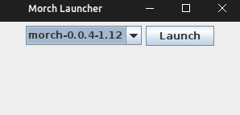

# MORCH LAUNCHER
[Morch Github](https://github.com/MorchClient) 
[Morch Installer](https://github.com/MorchClient/installer)

- This is an unofficial launcher for Morch!
- Currently, it was built and compiled for Linux, using JDK 17
- It's meant to directly replace the traditional Minecraft launcher, and have enhanced debugging.
- I made it myself :D

